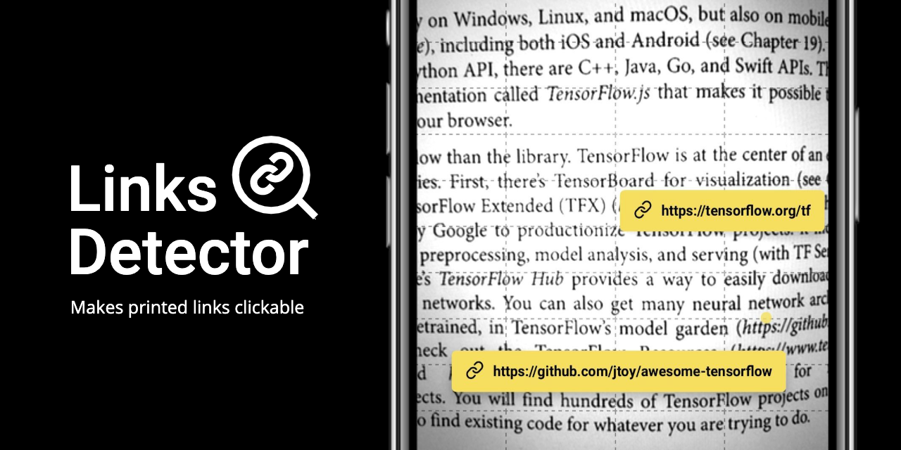

# 📖 👆🏻 Links Detector

> Links Detector makes printed links clickable _via your smartphone camera_. No need to type a link in, just scan and click on it.

🚀 [**Launch Links Detector**](https://trekhleb.github.io/links-detector)

## Problem

So you read a book or a magazine and see the link like `https://some-url.com/which/may/be/long?and_with_params=true`, but you can't click on it since it is printed. To visit this link you need to start typing it character by character in the browser's address bar, which may be pretty annoying and error prone.

## Solution

_Links Detector_ tries to detect and recognize such links for you and makes it clickable using you smartphone camera. So in result you should do just one click on the link instead of typing the whole link manually character by character.

## Limitations

⚠️ Currently the application is in _experimental_ _Alpha_ stage and has [many issues and limitations](https://github.com/trekhleb/links-detector/issues?q=is%3Aopen+is%3Aissue+label%3Aenhancement). So don't raise your expectations bar to high until these issues are resolved 🤷🏻‍.

## Technologies

_Links Detector_ is a pure frontend [React](https://create-react-app.dev/) application written on [TypeScript](https://www.typescriptlang.org/). Links detection is happening right in your browser without a need of sending images to the server.

_Links Detector_ is [PWA](https://web.dev/progressive-web-apps/) (Progressive Web App) friendly application made on top of a [Workbox](https://developers.google.com/web/tools/workbox) library. While you navigate through the app it tries to cache all resources to make them available offline and to make consequent visits much faster for you. You may also [install](https://developer.mozilla.org/en-US/docs/Web/Progressive_web_apps/Developer_guide/Installing) Links Detector as a standalone app on your smartphone.

Links detection and recognition happens by means of [TensorFlow](https://www.tensorflow.org) and [Tesseract.js](https://github.com/naptha/tesseract.js) libraries which in turn rely on [WebGL](https://developer.mozilla.org/en-US/docs/Web/API/WebGL_API) and [WebAssembly](https://developer.mozilla.org/en-US/docs/WebAssembly) browser support.
